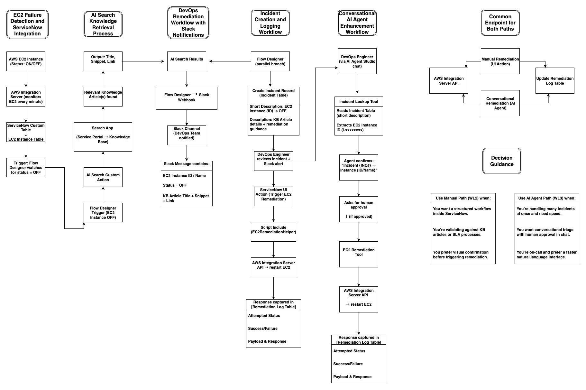

# EC2 AI Agent Enhancement System – ServiceNow Implementation  

## 📖 System Overview  

After Netflix deployed the **EC2 Monitoring and Remediation system (WL2)**, the DevOps team immediately saw value. EC2 failures triggered automatic incidents, Slack notifications carried AI-surfaced knowledge articles, and engineers could manually trigger remediation with a single click.  

But a new challenge emerged. During peak streaming hours—like when a hit new series dropped—multiple EC2 instances could fail at once. Engineers had to open each incident, read through descriptions, extract the instance ID, and click the remediation button. This manual bottleneck slowed down response times when speed mattered most.  

To solve this, we built the **EC2 AI Agent Enhancement (WL3)**:  
- An **AI-powered conversational assistant** that reads incidents, extracts EC2 instance IDs, confirms them with engineers, and executes remediation with human approval.  
- Engineers now have **two complementary workflows**: the proven WL2 manual path and the faster, AI-driven conversational path.  
- Both approaches converge on the same AWS Integration Server API, ensuring consistency, reliability, and unified logging in the Remediation Log.  

This system blends **automation with human oversight**—balancing Netflix’s need for speed with its commitment to safe, controlled operations.  

---

## 🛠️ Implementation Steps  

Building this system required carefully layering AI Agent functionality on top of the WL2 foundation:  

1. **AI Agent Creation**  
   - Name: `EC2 Remediation Assistant`  
   - Role: EC2 remediation specialist for DevOps operations  
   - Instructions:  
     1. Read incident records (short description).  
     2. Extract EC2 instance IDs (pattern: `i-xxxxxxxx`).  
     3. Confirm with engineer before proceeding.  
     4. Execute remediation script via API with human approval.  

2. **EC2 Instance Incident Report**  
   - Reads incident table (e.g., `INC0010014`) and parses the short description for valid EC2 IDs.  
   - Returns a **clean `instance_id`** to avoid passing entire text strings.
     

3. **EC2 Remediation Tool**  
   - Reuses the same logic from WL2’s `EC2RemediationHelper`, adapted as an AI Script Tool.  
   - Input: `instance_id`.  
   - Execution: Calls AWS Integration Server API, logs attempt in the Remediation Log.  

4. **Agent Integration**  
   - Tools (Lookup + Remediation) linked to the AI Agent.  
   - Execution mode: **Supervised** to ensure human approval is always required.  

5. **Testing and Validation**  
   - Conversational query: *“Help me with incident INC0010014.”*  
   - Agent extracts: `i-09ae69f1cb71f622e`.  
   - Asks: *“Do you want me to restart this instance?”*  
   - On approval, remediation executes and is logged identically to WL2.  

---

## 🗺️ Architecture Diagram  

---

## ⚡ Optimization  

This dual-path system gives DevOps engineers **choice and flexibility**:  

- **Manual Path (WL2)**  
  - Best when engineers want structured workflows inside ServiceNow.  
  - Useful for cross-team collaboration, SLA validation, and KB-driven remediation.  

- **AI Conversational Path (WL3)**  
  - Best during **peak hours** when speed is critical.  
  - Ideal for engineers who prefer natural language, or when handling multiple incidents simultaneously.  
  - Reduces context-switching (no need to navigate through records manually).  

**Architectural trade-offs**:  
- Conversational workflows are faster but rely heavily on accurate incident parsing.  
- Manual workflows are slightly slower but provide built-in UI visibility.  
- Both approaches ultimately converge on the **same AWS Integration Server API** and update the **same Remediation Log**, ensuring reliability and auditability.  

---

## 👩‍💻 DevOps Usage  

**Scenario 1 – Manual Path**  
1. Engineer receives Slack alert: *“EC2 Instance i-09ae69f1cb71f622e is OFF.”*  
2. Opens linked Incident in ServiceNow.  
3. Clicks **“Trigger EC2 Remediation”**.  
4. Remediation executes, result logged.  

**Scenario 2 – AI Conversational Path**  
1. Engineer types in chat: *“Help with incident INC0010014.”*  
2. Agent extracts EC2 ID → *“Incident INC0010014 is linked to i-09ae69f1cb71f622e. Do you want to restart it?”*  
3. Engineer approves.  
4. Remediation executes, result logged.  

**Outcome:**  
Both scenarios lead to the same AWS Integration Server API call, and both log results in the **Remediation Log Table**. Engineers can choose whichever method best fits the situation.  

---

## 📝 Script Comparison Analysis  

- **WL2 – Script Include (`EC2RemediationHelper`)**  
  - Input: `sys_id` from EC2 Instance record.  
  - Triggered via UI Action.  
  - Workflow is **UI-driven**, initiated from the Incident form.  

- **WL3 – AI Agent Script Tool (`EC2 Remediation Tool`)**  
  - Input: `instance_id` extracted from natural language (e.g., incident description).  
  - Triggered via conversation with AI Agent.  
  - Workflow is **chat-driven**, initiated by natural language request.  

**Key Differences:**  
- Input method (sys_id vs. instance_id).  
- Trigger context (UI form vs. conversational request).  
- Same API integration and logging outcome.  

**Result:**  
Both systems achieve identical remediation, but WL3 reduces manual navigation, providing speed and conversational accessibility.  

---

✨ With this enhancement, Netflix engineers can respond to EC2 failures **faster, safer, and smarter**—choosing between **structured manual workflows** or **AI-powered conversational workflows**, all backed by the same reliable remediation engine.  

